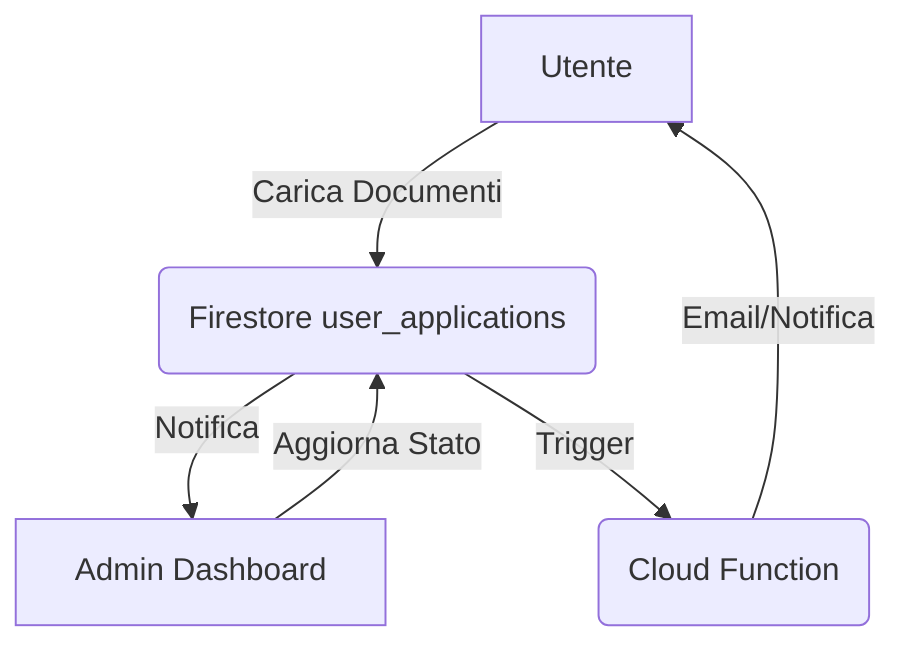

# Piano Gestione Pratiche (Admin)

## Obiettivo
Permettere agli amministratori di visualizzare, gestire e aggiornare lo stato delle pratiche (`user_applications`) inviate dagli utenti.

## Architettura
1. **UI (Admin Dashboard):**
   - Lista di tutte le pratiche con filtri (stato, utente, data).
   - Dettaglio pratica: visualizzazione documenti caricati, dati OCR estratti, stato attuale.
   - Azioni: "Approva", "Richiedi Integrazione", "Rifiuta".

2. **Firestore:**
   - `user_applications/{applicationId}`: aggiornamento del campo `status` e aggiunta di note admin.

## Diagramma di Flusso

## Task
- [ ] Creare `ApplicationsController` in `euclaim_admin`.
- [ ] Implementare `ApplicationsListScreen` con filtri.
- [ ] Implementare `ApplicationDetailScreen` per visualizzazione e gestione.
- [ ] Implementare logica di aggiornamento stato e note.
