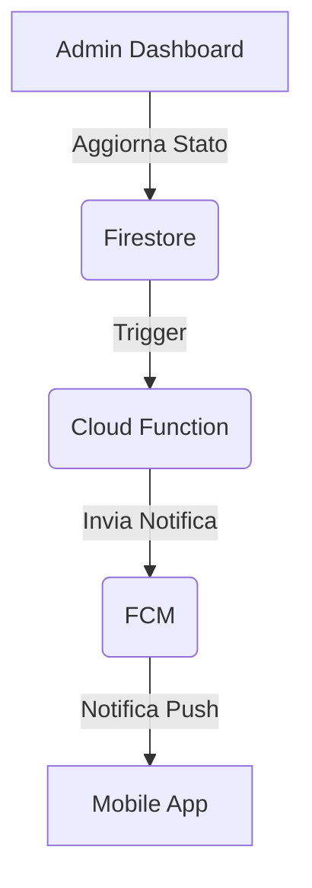

# Piano Integrazione Firebase Cloud Messaging (FCM)

## Obiettivo
Implementare notifiche push per avvisare gli utenti su aggiornamenti di stato delle pratiche (`user_applications`).

## Architettura
1. **Client (Mobile):**
   - Configurazione `firebase_messaging` in `euclaim_mobile`.
   - Richiesta permessi notifiche all'avvio.
   - Registrazione token FCM su Firestore (`users/{userId}/fcmTokens`).
   - Gestione notifiche in foreground/background/terminated.

2. **Backend (Cloud Functions):**
   - Trigger su `onUpdate` di `user_applications`.
   - Se `status` cambia, invio notifica tramite `admin.messaging().send()`.

## Diagramma di Flusso

## Task
- [ ] Installare `firebase_messaging` in `euclaim_mobile`.
- [ ] Implementare `NotificationService` in `euclaim_mobile`.
- [ ] Creare Cloud Function `sendNotificationOnStatusChange` in `functions/index.js`.
- [ ] Aggiornare Firestore Security Rules per permettere la scrittura dei token.
