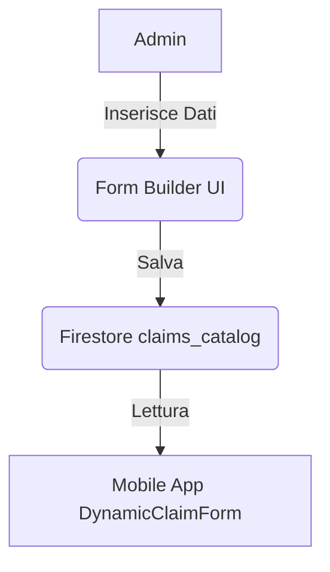

# Piano Dynamic Form Builder (Admin)

## Obiettivo
Permettere agli amministratori di creare e modificare i requisiti documentali (`requiredDocs`) per ogni causa nel `claims_catalog` senza modificare il codice.

## Architettura
1. **UI (Admin Dashboard):**
   - Form per definire il nome della causa.
   - Lista dinamica di campi (es. "Documento Identità", "Contratto", "Fattura").
   - Ogni campo ha: `label`, `type` (image/pdf), `required` (bool).
   - Pulsante "Salva" che aggiorna il documento in `claims_catalog`.

2. **Firestore:**
   - `claims_catalog/{claimId}` conterrà un array di oggetti `requiredDocs`.

## Diagramma di Flusso

## Task
- [ ] Creare `FormBuilderController` in `euclaim_admin`.
- [ ] Implementare `FormBuilderScreen` con campi dinamici.
- [ ] Implementare logica di salvataggio su Firestore.
- [ ] Aggiornare `DynamicClaimForm` in `euclaim_mobile` per leggere la nuova struttura.
